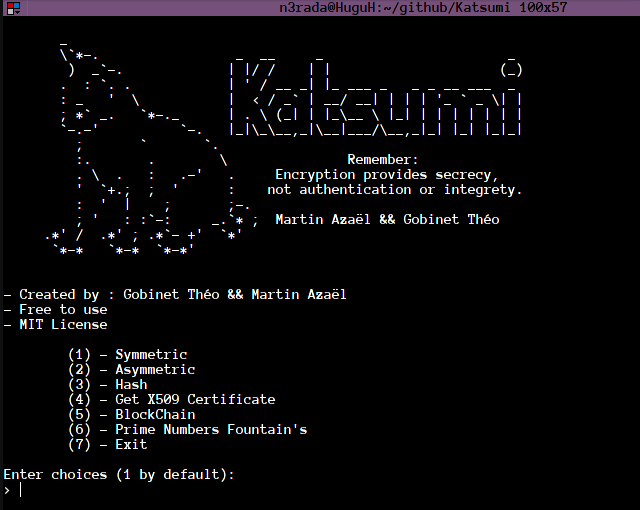
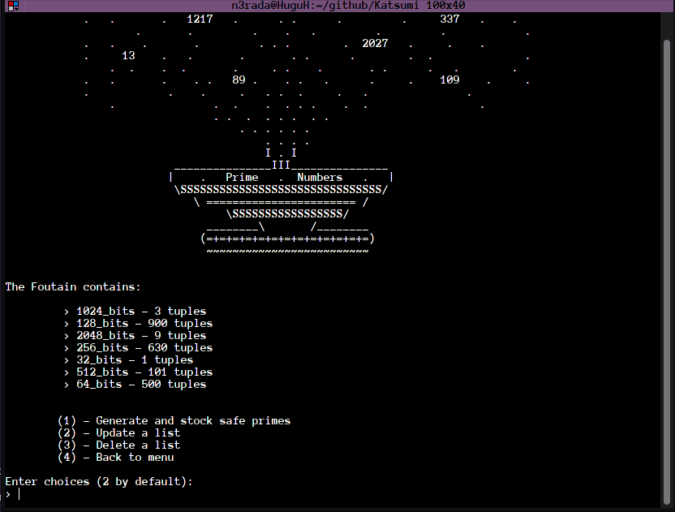

                    _                        
                    \`*-.                 _  __     _                       _    
                     )  _`-.             | |/ /    | |                     (_)    
                    .  : `. .            | ' / __ _| |_ ___ _   _ _ __ ___  _     
                    : _   '  \           |  < / _` | __/ __| | | | '_ ` _ \| |    
                    ; *` _.   `*-._      | . \ (_| | |_\__ \ |_| | | | | | | |    
                    `-.-'          `-.   |_|\_\__,_|\__|___/\__,_|_| |_| |_|_|    
                      ;       `       `.     
                      :.       .        \               Remember: 
                      . \  .   :   .-'   .     Encryption provides secrecy,
                      '  `+.;  ;  '      :    not authentication or integrety.
                      :  '  |    ;       ;-. 
                      ; '   : :`-:     _.`* ;  Martin Azaël && Gobinet Théo 
                  .*' /  .*' ; .*`- +'  `*' 
                  `*-*   `*-*  `*-*'           

`Katsumi` est un outil interactif de cryptographie.

**Conçu** sur Arch Linux et Windows 10 **pour les systèmes d'exploitation Linux et Windows**.

[Black](https://github.com/psf/black) a été utilisé pour vérifier le formatage de notre code:

```
sudo black Katsumi/
```

Réalisé sous le respect de [PEP8](https://www.python.org/dev/peps/pep-0008/)

[](https://www.codefactor.io/repository/github/theogobinet/katsumi)


**Lire ceci dans un autre language**: [English](README.md)

## Sommaire

- [A propos](#A_propos)
- [Installation](#Installation)
- [Vue d'ensemble](#Vue-d'ensemble)
    - [Structure](#Structure)
        - [Symétrique](#Symétrique)
        - [Asymétriqie](#Asymétrique)
        - [BlockChain](#BlockChain)
    - [Choix d'implémentation](#Choix-d'implémentation)
        - [Fontaine à nombres premiers](#Fontaine-à-nombres-premiers)
    - [Performances](#Performances)
    - [Améliorations](#Améliorations)
- [Auteurs](#Auteurs)
- [Licence](#Licence)
- [Documentation](#Documentation)

## A propos
C'est un projet cryptogrpahique réalisé au sein de l'[UTT](https://www.utt.fr/) pour le projet de [GS15](images/GS15.png).
Pour plus ample informations, cliquez [ici](pdfs/Projet.pdf).

## Installation
* Clonez le dépôt puis allez dans le dossier éponyme et lancez "katsumi.py" avec python 3.

* *Pas de requirements.txt nécessaire* . Tout fonctionne sans avoir besoin de bibliothèques supplémentaires. Une installation native de python3 suffit !

## Vue d'ensemble
Ce projet a été initialement consacré au développement d'une version modifiée de l'agorithme de [chiffrement symétrique de Kasumi](https://en.wikipedia.org/wiki/KASUMI) puis à la génération d'une paire de clés publiques/privées pour enfin rassembler toutes les connaissances acquises et simuler une [blockchain](pdfs/blockChain_article.pdf).
### Structure
Le code source est ordonné ainsi:
* Le dossier ["coeur"](core/) contient le cœur du programme.Tout ce qui concerne les méthodes de chiffrement symétriques, asymétriques et basées sur le hachage.(c'est à dire [la BlockChain](core/hashbased/blockchain.py)).
* Le dossier ["traitement"](processing/) qui contient toutes les sorties du programme destinées à l'utilisateur (c'est-à-dire les clés publiques/privées, les signatures numériques et les choses chiffrées).
* Le dossier ["resources"](ressources/) contient tous les fichiers de code les plus importants. C'est là que se trouvent la plupart des fonctions primaires.

#### Symétrique
<p align="center">
  
</p>

#### Asymétrique

<p align="center">
  
</p>

#### BlockChain

<p align="center">
  
</p>


### Choix d'implémentation

* Le polynôme primitif du champ d'extension binaire GF(2) de degré 16 a été trouvé [en ligne](https://www.partow.net/programming/polynomials/index.html) et codé en dur dans un [fichier de configuration] (ressources/config.py).

* Pour faciliter la manipulation des inverses dans les champs de Galois, nous avons [pré-enregistré en mémoire les inverses](ressources/generated/inversion_Sbox.txt) du champ de Galois degré 16 (lui-même écrit en brut).

* Le fichier [Inversion_Sbox.txt](ressources/generated/inversion_Sbox.txt) est vérifié à chaque démarrage et s'il est corrompu (pas ici ou faux), le programme en génère un avant de démarrer.

* Tout générateur pour El-Gamal est conçu pour résister aux attaques courantes et il est trouvé via le principe du [groupe de Schnorr](https://en.wikipedia.org/wiki/Schnorr_group). Vous trouverez plus d'information en lisant le code [ici](core/asymmetric/elGamal.py).

* La génération de nombres premiers sûrs se fait en optimisant la recherche. Nous partons d'un nombre premier p et vérifions si 2p+1 est également premier OU si (p-1)/2 est également premier. [Le code source dédié à ce sujet](ressources/prng.py) a été commenté afin de comprendre le processus de réflexion.

* La difficulté de la [preuve de travail](https://en.wikipedia.org/wiki/Proof_of_work) établie est ajusté en fonction de la taille des blocs en utilisant une fonction de puissance approximée par induction (c'est-à-dire par expérimentation).

* La simulation de la blockchain est sur un seul thread, donc l'ajout de mineurs n'accélérera pas la validation des blocs. Comme nous pouvons influer directement sur la difficulté de validation des blocs, cela ne pose pas de problème pour la compréhension de la simulation.

* La simulation de la blockchain utilise [UTXO](https://medium.com/bitbees/what-the-heck-is-utxo-ca68f2651819) comme système. Courrament utilisé pour le Bitcoin.

* Pour [RSA](core/asymmetric/RSA.py) ou [ElGamal](core/asymmetric/elGamal.py) chiffrement/déchiffrement, **si le message est plus long que le module choisi, cela cause un problème pour procéder** (c'est-à-dire mathématiquement hors du module). Pour surmonter cette difficulté, nous  **utilisons une fonction réversible** : *Si le message d'entrée est plus grand (après conversion en nombre entier) que le module de notre algorithme de chiffrement, nous divisons ledit message en plusieurs parties strictement inférieures à la taille du module (c'est-à-dire qu'avec une clé de 128 bits, un message de 488 bits est divisé en sous-messages de 120 bits).*.

* La base64 est utilisée à la place de l'hexadécimal pour le stockage et l'affichage des clés et/ou des messages chiffrés. **La base 64 prend 4 caractères pour 3 octets, ce qui la rend plus efficace que l'hexadécimal.**

#### Fontaine à nombres premiers

La génération de nombres premiers sûrs peut prendre beaucoup de temps de calcul. Pour surmonter ce problème, nous avons imaginé de stocker nos safe primes dans un endroit accessible et modifiable. Nous avons décidé d'appeler cette chose : [**La fontaine à nombres premiers**](ressources/generated/PrimeNumber's_Fount)

<p align="center">
  
</p>

Grâce à cette méthode, l'utilisateur peut faire charger des nombres premiers sûrs pendant son temps libre et les utiliser de manière appropriée au bon moment.

**Python use nativement qu'un seul coeur**. On a donc [mulitprocessé la recheche d'un nombre premier sûr](ressources/prng.py) usant 85% de la capacité de vos coeurs.

### Performances
**Each measurement is based on a i7-10510U with 2.5GHz**.

* La génération des inverses dans un champ de Galois binaire (Z2) de degré 16 prend environ **117 secondes** (moyenne sur 5 essais).
* La génération d'un **nombre premier sûr de 512 bits** prend en moyenne **12.4 secondes** pour 10 tests.
* La génération d'un **nombre premier sûr de 2048 bits** prend en moyenne **71 minutes** pour 4 tests.

### Améliorations
* Une amélioration évidente serait d'intégrer les [courbes elliptiques] (https://en.wikipedia.org/wiki/Elliptic-curve_cryptography). Il s'agit d'une idée qui est apparue à la fin du semestre et qui, dans le respect du délai, n'a pas pu être mise en œuvre (et n'était pas requise).

* Utiliser les [signatures de Shnorr](https://medium.com/digitalassetresearch/schnorr-signatures-the-inevitability-of-privacy-in-bitcoin-b2f45a1f7287) pour notre BlockChain.

* Regrouper RSA et ElGamal dans une classe mère pour bénéficier de l'héritage des fonctions (c'est-à-dire utiliser la programmation orientée objet).

## Auteurs
* **Azaël MARTIN** - [n3rada](https://github.com/n3rada)
* **Théo GOBINET** - [Elec](https://github.com/theogobinet)

## Licence
Katsumi est sous les termes de la licence MIT 
et est disponible gratuitement - voir le fichier [LICENSE.md](LICENSE.md) pour plus de détails.

## Documentation
Voici quelques liens utiles pour aider à la compréhension de certains points du sujet:

* https://en.wikipedia.org/wiki/Quadratic_residue
* https://en.wikipedia.org/wiki/Cryptographically_secure_pseudorandom_number_generator
* https://andersbrownworth.com/blockchain/
* https://www.random.org/analysis/
* https://en.wikipedia.org/wiki/Hamming_weight
* https://www.keylength.com/  - pour choisir la taille des clés
* https://blkcipher.pl/assets/pdfs/gcm-spec.pdf - pour l'implémentation de GCM