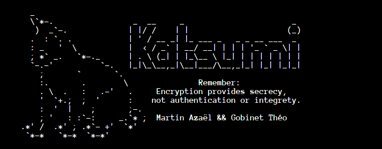
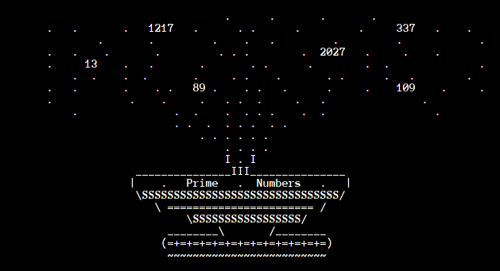

`Katsumi` is an interactive cryptographical tool.

*Designed* on Arch Linux and Windows 10 *for Linux and Windows operating systems*.

## Table of content

- [About](#About)
- [Installation](#Installation)
- [Overview](#Performance)
    - [Structure](#Structure)
    - [Features](#Features)
    - [Performances](#Performances)
- [Authors](#Authors)
- [License](#License)
- [Links](#Links)
## About
It is a school cryptography project carried out at the [UTT](https://www.utt.fr/) for the [GS15](images/GS15.png) subject.
For more information about this subject, click [here](pdfs/Projet.pdf) (it's in French).

## Installation
Clone the repository then go to the eponymous folder and launch "katsumi.py" with python 3.

## Installation

### Structure

### Features

#### Prime Number's Fountain

### Performances

## Authors

|       	|      
|:-----------------------------------------------------------------:|      
|                                 **n3rada**                        |

|         |
|:-----------------------------------------------------------------:|
|                            **Elec**                               |
## Licence
Katsumi is licensed under the terms of the MIT Licence 
and is available for free.

## Links