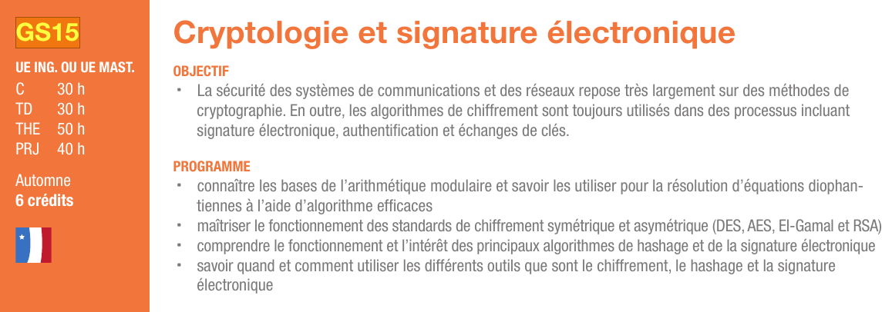

`Katsumi` is an interactive cryptographical tool.

*Designed* on Arch Linux and Windows 10 *for Linux and Windows operating systems*.

## Table of content

- [About](#About)
- [Installation](#Installation)
- [Overview](#Performance)
    - [Structure](#Structure)
    - [Features](#Features)
    - [Performances](#Performances)
- [License](#License)
- [Links](#Links)
## About
It is a school cryptography project carried out at the UTT for the GS15 subject. For more information about this subject, click on the course's decription below to see the given subject:

## Installation
Clone the repository then go to the eponymous folder and launch "katsumi.py" with python 3.

## Installation

### Structure

### Features

#### Prime Number's Fountain

### Performances

## Licence
Katsumi is licensed under the terms of the MIT Licence 
and is available for free.

## Links